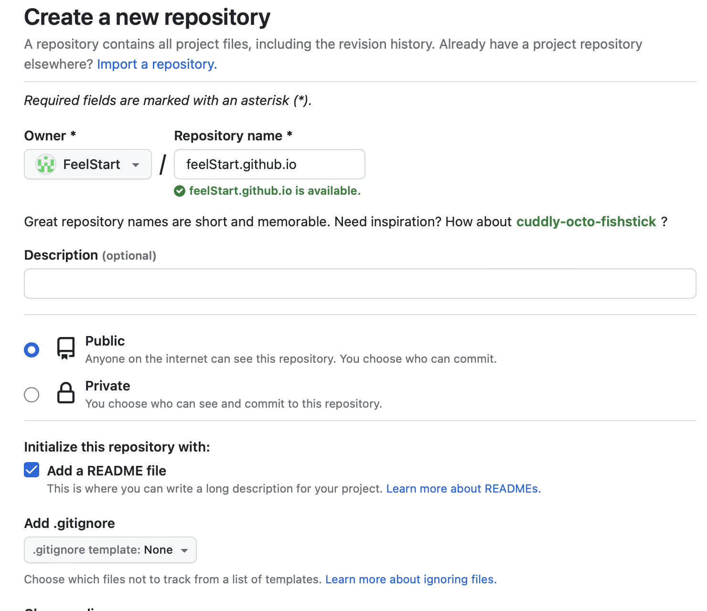
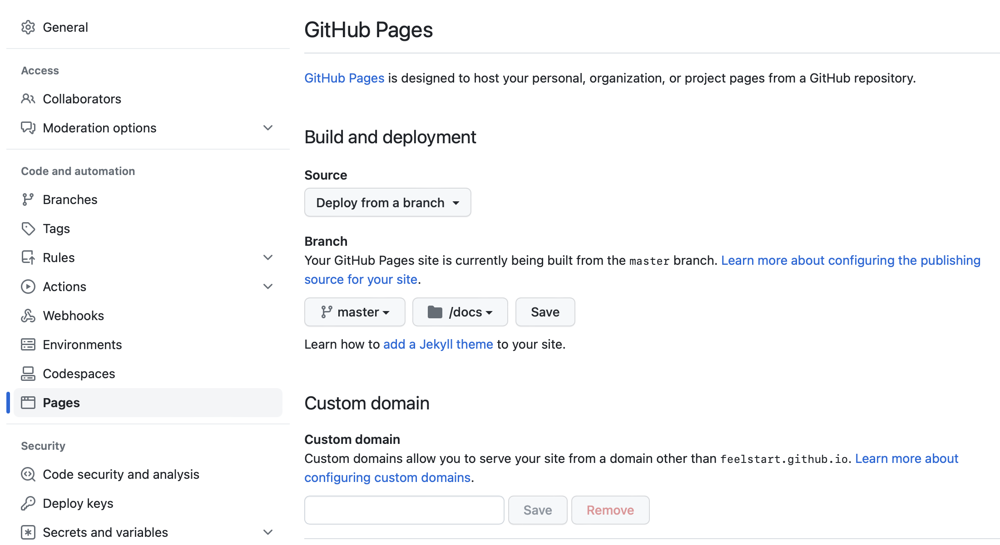

# github pages 和 Hugo 搭建个人博客


最近想写点东西。现在主流的平台，如知乎，简书，公众号等，提供了好多方便，但也限制了许多。于是，我就考虑自己搭建。

花了差不多一天的时间，决定用 github pages 和 Hugo 搭建个人博客。

为什么用 github pages？

* 免费。

github pages 有什么限制呢？

* 1 GB的空间。
* 国内网络访问慢
* 更新同步不及时

为什么用 Hugo ？

之前也比较过 Jekyll，Hexo 和 Hugo，最后还是用 Hugo，因为它：

* 简单
* 方便
* 弱依赖
* 快速
* 主题丰富

## 配置 github 仓库

### 创建仓库

创建 github 仓库，创建名称为 '仓库名称.github.com'。



### 配置 pages



### 拉取仓库
```
$ git clone git@github.com-xxx:FeelStart/feelStart.github.io.git
```

`` git@github.com-xxx `` 是因为我本地配置的 ssh 的 HostName。

### 创建 dosc 目录

```
$ mkdir dosc
```

在上面的配置 pages，我们设置 master/dosc 的目录作为主路径。


## Hugo

### 安装 Hugo

这里我是 mac 电脑，用 brew 进行安装。

```
brew install hugo
```

### 创建 Hugo 网站

```
$ mkdir hugo 
$ cd hugo 
$ hugo new site .
```

### 配置 Hugo 公开目录

```
$ echo 'publishDir = "../dosc"' >> config.toml
```

### 用 Hugo 创建博客

```
$ hugo new posts/hello.md
```

注意，要删除创建文件里面的 ``` draft: true ```.

### Hugo 主题

```
$ git submodule add https://github.com/budparr/gohugo-theme-ananke.git themes/ananke
$ echo 'theme = "ananke"' >> config.toml
```

### 创建静态 Html

```
$ hugo
```

### 本地测试

```
$ hugo server
```

### 推送到仓库

```
$ git push -U master
```

### version

v1.0.0.24.1.29.4

## 参考

[github page](https://docs.github.com/en/pages/getting-started-with-github-pages/about-github-pages)

[](https://zhuanlan.zhihu.com/p/37752930)

[workflow](https://gohugo.io/hosting-and-deployment/hosting-on-github/#build-hugo-with-github-action)