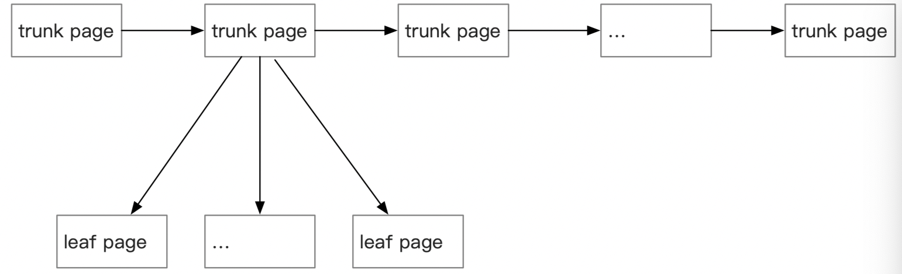

sqlite 有个主文件。在数据库事务时，还会创建回滚日志或者预写文件。

## 1 文件头

sqlite 主文件前 100 字节表示头部。

|  偏移   | 大小      |    描述   |
|  ----  | ----      | ----     | 
| 0      | 16        | 魔数。其字符串为 "SQLite format 3\000" |
| 16     | 2         | 页数目|
| 18     | 1         | 写入版本的文件格式。1 表示遗留的格式，2 表示 WAL。|
| 19     | 1         | 读入版本的文件格式。1 表示遗留的格式，2 表示 WAL。|
| 20     | 1         | 每页尾部未使用的保留字节。通常为 0 |
| 21     | 1         | 最大嵌入有效载荷部分。必须是 64 |
| 22     | 1         | 最小嵌入有效载荷部分。必须是 32 |
| 23     | 1         | 叶子有效载荷部分。必须是 32 |
| 24     | 4         | 文件更改计数 |
| 28     | 4         | 数据库文件的大小（以页为单位） |
| 32     | 4         | 第一个空闲主干页的页码 |
| 36     | 4         | 全部空闲页的数目 |
| 40     | 4         | schema 缓存 |
| 44     | 4         | schema 格式数字。支持 1、2、3、4. |
| 48     | 4         | 默认页缓存大小 |
| 52     | 4         | auto-vacuum 或 incremental-vacuum 模式下，最大 root BTree 的页码 |
| 56     | 4         | 数据库文本编码。1 表示 UTF-8，2 表示 UTF-16le，3 表示 UTF-16be |
| 60     | 4         | 所读的 “用户版本”。|
| 64     | 4         | True 表示 incremental-vacuum 模式。 |
| 68     | 4         | “Application ID” |
| 72     | 20        | 保留为以后扩展 |
| 92     | 4         | 版本有效号码 |
| 96     | 4         | sqlite 版本有效号码 |

## 2 页

数据库文件由一个个页组成。页大小是 512 和 65536 之间的 2 的幂。第一个页的页码为 1。

## 2.1 页的用法

### 2.1.1 用于锁字节的页

由操作系统特殊的 VFS 实现的文件锁。比如 window 的 lockfile()。

sqlite 不会对该页进行对写。

### 2.1.2 用于空闲的页

空闲页又分：

* 主干空闲页 (trunk page)
* 叶子空闲页 (leaf page)

### 2.1.3 用于 b-tree 的页

### 2.1.4 用于有效负载溢出的页

如 Index BTree 超出的 key 会存储在这里。

### 2.1.5 用于指针映射的页

## 3 b-tree 

在面向页存储的设备上，b-tree 算法用唯一且有序的 key 存储数据。

sqlite 中 b-tree 有两种变体：

* Table b-tree

  Table b-tree 用 64 位有符号整数作为 key，存储数据在叶子节点。

* Index b-tree

  Index b-tree 只存储 key。
  
b-tree 有两种：

* 内部页（interior page）
 
  包含 k 个 keys 和 k + 1 个指向子页的指针。指针是 32 位无符号的页码。

* 叶页（leaf page）

  包含 key。如果是 Table b-tree，还会有对应的数据。
  
 
### 3.1 单元（cell）

* 内部页中，单元包括 key 和指针（pointer）。

* 叶子页中：

  * Index b-tree，单元包括 key。
  * Table b-tree，单元包括 key 和数据。

### 3.2 b-tree 区域

Btree 按顺序分以下区域：

* 100 字节的头部
* 8 或 12 字节叶头
* cell 指针数组
* 未分配空间
* 单元内容
* 保留

### 3.3 叶头

|  偏移   | 大小      |    描述   |
|  ----  | ----      | ----     | 
| 0      | 1        | Btree 的类型。2 表示内部 index btree 页，5 表示内部 table btree 页，10 表示叶子 index btree，13 表示叶子 table btree |
| 1     | 2         | 页的第一个空闲块 |
| 3     | 2         | 单元的数目 |
| 5     | 2         | 单元内容开始区域 |
| 7     | 1         | 单元内容碎片字节数 |
| 8     | 4         | 最右边的指针 |

## 参考

[doc](https://www.sqlite.org/fileformat.html)
