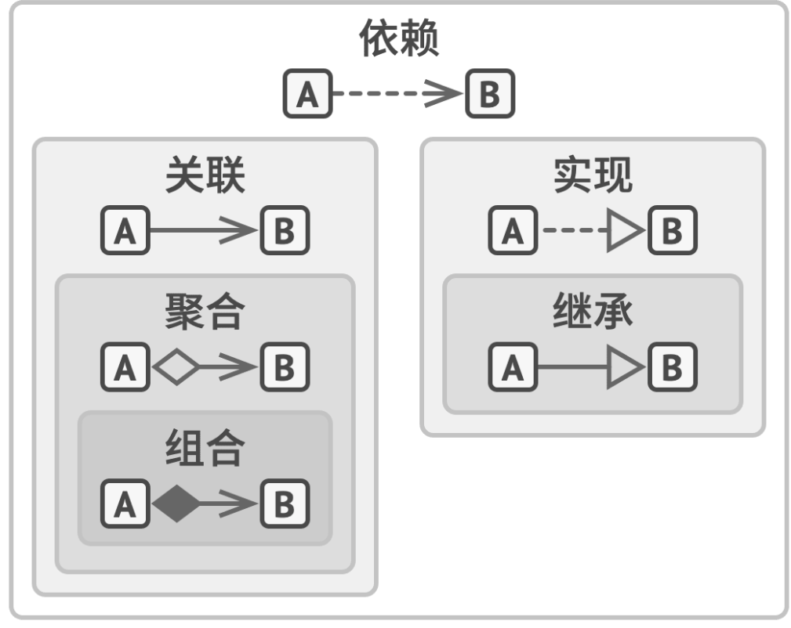

# 读书笔记-《深入设计模式》

万物有名，我们从名中理解这个世界。在面向对象编程中，这个“名”就是对象，包含属性和行为。 

## 1 特性

### 1.1 抽象
面对对象编程是对现实的抽象。当我们要做一个需求时，需要对需求进行划分，定义好概念，把这些抽象为一个个对象，并定义好它们之间的联系。

### 1.2 封装
封装定义对象公开和私有的属性和方法。有的编程语言会支持接口的特性，对象暴露出来的是接口，而不是具体的实现。好的封装应该体现充分性。

### 1.3 继承

继承是对象的关系。比如人，而人属于动物。人是动物的子类，动物是人的父类。通过继承关系，可以很好地除去重复的代码。

### 1.4 多态

多态是同父类，对于同种行为，有不同的表现。

## 2 关系

### 2.1 依赖关系
修改其中一个类，会影响另一个类。
### 2.2 关联关系
### 2.3 聚合关系
一个类包含多个另外的类
### 2.4 组合关系

### 2.5 实现关系

### 2.6 继承关系
父类与子类之间的关系
